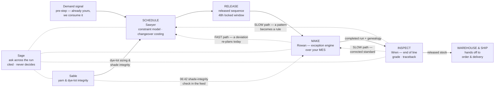

# Service blueprint — the run lifecycle, today and with the agentic layer

**Module:** Shaw Research · **File:** 04-service-blueprint.md · **Status:** draft for review
**Primary sources:** demo build (`unifyapps-manufacturing-demo 1.html`), workshop spec (`Shaw_Manufacturing_Workshop_Spec.md` incl. §6 domain rail), personas (`01-personas.md`), pain register (`03-pain-points.md`), section deep-dives (`02-journeys/01–06`), handoff docs (GLOSSARY, LOGIC, CLICK-PATH).

**Read this first.** Every figure, ID, plant, customer, dollar amount and timing quoted from the demo is **invented demo data** — internally consistent, benchmarked against nothing, and it says so on screen. The process stages in §1 come from general flooring-industry material, **not from Shaw**. Backing 2 as the constraint line is [ASSUMED]. Whether Shaw's planning system reaches the plant (APS versus spreadsheet) and the room composition are [OPEN]. Sable and Sage do not exist in the workshop spec, which defines three agents — Sawyer, Rowan, Wren; both are demo-build extensions and every row that uses them inherits that provenance. Markers throughout: [SOURCED] / [INTERNAL] / [ASSUMED] / [OPEN].

The rule for the whole document, verbatim from the spec: **the agents move the run; the people make the calls.** The three lanes, wording preserved exactly:

| Lane | Wording |
|---|---|
| **AUTOMATED** | The agent just does it. Nobody has to ask, chase or put it together. |
| **THRESHOLDED** | The agent acts inside limits you set. Outside them it stops and asks. |
| **A PERSON** | Judgement. The agent prepares it — the call is yours. |

And what the agents never do, whatever the dial says: **run the line · write the demand plan · grade the product · overrule a quality hold.**

---

## 1. Industry context — how a carpet plant typically runs today

The physical make chain — extrusion → yarn processing → tufting → dyeing or printing → backing → finishing — is [SOURCED] from general flooring-industry material and is **explicitly out of scope**: the MES runs the make, and these agents sit on top of it. What matters for this blueprint is the *run lifecycle around* the make — the planning, execution, inspection and claims process that wraps it. Those stages below are [SOURCED] to general flooring-industry practice, **not Shaw-specific**; every characterisation of how the work is actually done is [ASSUMED] industry-typical, unverified at Shaw.

**The lifecycle:**

| # | Stage | What happens | Grain and cadence |
|---|---|---|---|
| 1 | **Demand signal** | Forecast and order book become a volume requirement | Months → weeks, product family → SKU [SOURCED — standard planning layering] |
| 2 | **Master schedule** | The MPS: what to make, how much, which week — a commitment sales promise against, with a cadence and a sign-off | Weekly, SKU / style-colour [SOURCED — standard vocabulary] |
| 3 | **Sequence and release** | Line-level run order — which line, what order, what hour — released to the floor | Daily, operation-level [SOURCED]; whether an APS does this at Shaw or a spreadsheet does is [OPEN] |
| 4 | **Run / make** | MES dispatches; the lines run; rates, downtime and holds accumulate | Continuous [SOURCED as MES territory; MES-runs-the-make is [INTERNAL] for Shaw] |
| 5 | **End-of-line inspection** | Measurement against spec, grading first quality or seconds, disposition | Per roll [ASSUMED — in-process inspection is common in carpet and unverified at Shaw] |
| 6 | **Warehouse / ship** | Released stock ships against orders — the handoff to order and delivery | Per order [ASSUMED practice] |
| 7 | **Field claim** | A claim comes back weeks later and is settled — or argued — against manufacturing's records | Weeks after shipment [ASSUMED practice] |

**The rhythm that defines the whole thing [ASSUMED]: a weekly plan, then a daily firefight.** The schedule is built once a week at rough-cut capacity against standard rates, and it stops being true almost immediately — on the constraint line, within an hour of a slowdown. From then on the plant runs on phone calls, corridor decisions and spreadsheet re-juggles, and the plan and the floor diverge silently.

Four structural failures recur across the industry material and anchor everything that follows [ASSUMED throughout]:

1. **Discovery happens at shift handover.** A line drifts under rate mid-shift; the MES counters record it; nobody watching cross-system notices. The problem surfaces hours later, verbally, over a whiteboard — lossy, and too late to recover constraint hours, which are plant hours and cannot be bought back.
2. **Defects are found at end of line.** By the time shade variation shows up at inspection, the sequencing decision that caused it is hours or days old. The grade gets argued from memory; the batch sits on hold while the argument runs.
3. **Claims are argued without records.** Genealogy — which yarn lot went into which roll — is reconstructed by archaeology when a claim lands, hours to days of joining MES run records, dye logs and shift sheets by hand. Credits get issued just to close the argument.
4. **The volume number hides the broken promises.** Attainment (did you make the yards) is the wall number; adherence (did you make them in the planned sequence, on the planned day) is usually unmeasured — so 97% attainment can coexist with 62% adherence and read as success. Whether Shaw measures adherence, and their word for it, is [OPEN].

Where the scheduling problem actually lives [SOURCED — general industry material]: a small number of constrained lines, sequence-dependent changeovers (light → dark is cheap, dark → light needs a full purge), and the dye-lot constraint — carpet dyed in one batch; two lots of the same colour will not shade-match, so a large order should come from one lot. That is a genuine hard scheduling constraint and a general carpet fact, **not a verified Shaw operating rule**. The bottleneck in such plants is *typically* the backing/finishing line — many tufting machines, usually one continuous backing line — which is how the demo's "Backing 2" got its role: [ASSUMED], how these plants are normally built, not a claim about Shaw.

---

## 2. Service blueprint: TODAY

Stage-by-stage, classic blueprint bands. Everything in this table is [ASSUMED] industry-typical practice unless marked; timings are illustrative. Support systems named generically except Oracle Fusion and Databricks, the two [SOURCED] members of Shaw's stack.

| Stage | Persona actions | Frontstage evidence (what they look at) | Backstage actions (what other people do) | Support systems | Failure points |
|---|---|---|---|---|---|
| **1 · Demand signal** | Scheduler receives the demand signal as a volume requirement | Forecast export; order book | Sales enter commitments; customer service annotates orders — shade-criticality lives in order notes and memory | Demand planning system ("already solved" is [INTERNAL]); Oracle Fusion [SOURCED] | Shade-criticality is tribal, not structured data — promises get made against lots that can't hold them |
| **2 · Master schedule** | Master scheduler turns demand into a week of runs and **signs the MPS** — half a day to a day, weekly | APS screen or spreadsheet [OPEN]; rough-cut capacity check | Materials planner runs MRP; yarn planner sizes dye lots with a 10–15% rule-of-thumb overage in a spreadsheet | APS **or spreadsheet [OPEN]**; MRP; Oracle Fusion | Rough-cut only, at standard rates that stop being true by Tuesday; the overage is a guess unlinked to shade-critical orders; the commitment is signed against unproven capacity |
| **3 · Sequence & release** | Scheduler hand-builds the line-level run order every evening (1–2 h), changeover logic from memory, dye-lot checks manual; emails or prints the list | The spreadsheet; the printed sequence on the floor | Dye-house lead orders colours light → dark on a whiteboard, redone at every change; maintenance planner negotiates PM windows by phone; MES dispatches | Spreadsheet / APS [OPEN]; MES; maintenance system | Sequence-dependent changeover cost invisible at edit time — it lives in one head; the frozen window is enforced socially; the floor works from a snapshot |
| **4 · Run / make** | Line manager runs the shift; discovers the slowdown **at handover or a walk-past**, hours late; assembles "how bad is it?" across 3–4 systems (1–2 h); corridor decision, overtime as the reflex; supervisor transcribes output and downtime at shift end (30–60 min), reason codes from memory | MES terminals and counters; the whiteboard; the phone | Scheduler re-juggles the spreadsheet under pressure, uncosted; customer service checks which commitments are hit, by hand; analyst builds the morning pack (1–2 h) from MES/ERP exports | MES & batch management; Oracle Fusion; maintenance system; Excel | The signal exists, the meaning doesn't — constraint hours drain silently; nobody converts a rate drop into a finish date and orders at risk; dates move silently; the downtime Pareto is part-fiction; the split-lot trap opens with no memory of last time |
| **5 · End-of-line inspection** | Inspector measures against spec; quality lead argues the borderline grade — inspector, supervisor, sometimes sales, from memory of the spec; batch held while the argument runs | Inspection station (paper or QC terminal [ASSUMED]); MES hold flags | Sales pulled into grade arguments; planners chase held stock that is blocking orders | MES hold flags; quality records; spreadsheets | The grade varies by who is on shift; clear passes cost what real calls cost; loss tracked in yards and percent, never as the first-quality-to-seconds margin gap; holds run hours–days |
| **6 · Warehouse / ship** | Warehouse ships released stock against orders | Pick and ship documents | Customer service confirms dates — often discovering they moved silently mid-shift | Oracle Fusion; warehouse processes (the supply-chain workshop's ground) | The promise broke upstream and surfaces here: the customer calls customer service before customer service knows |
| **7 · Field claim** | Claims liaison receives the claim weeks later and emails manufacturing for records; quality lead does the archaeology — MES run records, dye logs, shift sheets joined by hand (hours–days); credit issued to close the argument | Email chains; the claims system | Monthly quality review spots repeats from memory; the finding decays into a slide | Claims system; email; MES archives; Oracle Fusion credits | The claim is arguable, not settleable; the cause never reaches scheduling — three claims in four months, one cause, and the fourth is already scheduled, it just doesn't have an ID yet |

**The compounding is the point** (the pain register's cost-of-doing-nothing, all figures illustrative): late discovery buys bad options, bad options repeat old mistakes, old mistakes never become rules — while the week closes at 97% attainment and the wall number says everything is fine.

---

## 3. Service blueprint: WITH THE AGENTIC LAYER

Same stages. The layer **sits on top of what Shaw already runs and owns no data of its own** — it reads across your planning and scheduling system, MES and batch management, maintenance, quality and Oracle Fusion, with Databricks as the [SOURCED] analytics layer, and writes decisions back. Every read/write path is proposed [INTERNAL], not confirmed integration. Lane tags: **AUTO** / **THRESHOLDED** / **PERSON**.

| Stage | Persona actions | Product surface | Agent actions (lane-tagged) | Shaw systems underneath (reads → writes back) | Trust evidence on screen |
|---|---|---|---|---|---|
| **1 · Demand signal** | Unchanged — demand stays theirs | None, deliberately. Demand is a dashed pre-step: "Already yours. We consume the signal" | **AUTO** — Sawyer takes the demand signal as given. Never writes the demand plan (never-do #2) | Reads: demand planning output; order commitments from Oracle Fusion. Writes: nothing | The never-do stated on the Thresholds footer; the scope boundary stated on the sheet itself |
| **2 · Master schedule** | Master scheduler reviews the drafted week and **signs off — the MPS commitment stays theirs** (PERSON); decides when an order is split (PERSON) | **Scheduling / Sawyer** (board + constraint model); **Yarn / Sable** (lot sizing) | **AUTO** — sizes runs to batch and dye-lot rules, checks the week against capacity, rebuilds every cycle; Sable sizes dye lots to the orders they serve, continuously. **THRESHOLDED** — larger changes, or anything inside the locked window, come to a person before publish. **PERSON** — sign-off; order splits | Reads: demand signal; commitments, quantities, dates from Oracle Fusion; MRP requirements; achieved rates from MES; PM windows from maintenance. Writes: the draft schedule back to your planning and scheduling system [proposed] | Released/Draft chip — nothing publishes without the signature; "Illustrative data" chip on every view; Sable's $8,400 hero (flagged honestly: no drill-in in this build — it must earn its number) |
| **3 · Sequence & release** | Scheduler touches the board — selects a run, moves it Earlier/Later, tries the split, **re-releases** (PERSON) | **Scheduling / Sawyer** board; **Yarn / Sable** creel sequence | **AUTO** — costs changeovers pairwise on every edit, releases inside the rules; Sable sequences the creel light → dark where dates allow. **THRESHOLDED** — reorders runs inside the constraint model; anything that breaks a dye lot, moves a promised date, or touches the 48h locked window **stops and asks**. **PERSON** — approves the released sequence, owns what it promises | Reads: constraint model; dye-lot and batch data from MES and batch management. Writes: the released sequence to MES for dispatch [proposed] | Verdict strip recomputed per move — Holds / Breaks a rule with live changeover dollars; the hatched locked-window band; the split verdict citing CLM-2291; the Draft → Re-release gate |
| **4 · Run / make** | Line manager is **told at 06:40, not at handover**; reads the feed; weighs three costed options; makes "the dye lot or the date" call (PERSON) — or, where the plant's dial says Auto, reads why the agent handled it. Maintenance planner approves the drafted work order. Anyone asks Sage mid-incident | **Make / Rowan**; **Overview** inbox (ranked by what it costs you); **Sage** drawer | **AUTO** — detects −12% past the ±8% band at 06:38; computes +5h 10m and flags ORD-77310 (fixed install); notifies line lead + plant manager; costs and ranks 3 options ($1,840 / $0 / $6,200); Sable's 06:42 shade-integrity check; genealogy written as the run happens; reports self-build. **THRESHOLDED** — reshuffles the rest of the day inside limits; **stops short of re-sequencing Backing 2 — every option there moves a promised date**; drafts the WO from the vibration signal. **PERSON** — the dye lot or the date | Reads: MES counters, rates, downtime, holds; the released plan; Oracle Fusion commitments (fixed vs movable dates); maintenance calendar and condition signals; claims history via Databricks. Writes: notifications out; the WO into your maintenance system (with context attached, for approval); the accepted decision to Sawyer | The activity feed — five purple, one amber, one black, every entry lane-chipped and drillable; the amber entry naming where the agent's authority ended; Option B's history warning ("You did this on DL-4102 in June — it produced CLM-2291"); "reason code pending" said honestly on the tile; "predictive maintenance — not demo-ready" printed on the card; **Undo** |
| **5 · End-of-line inspection** | Quality lead grades R-11204 from the evidence — **Decide grade** (PERSON); the hold is theirs and no agent overrules it (never-do #4) | **Quality / Wren** (inspection queue); Overview inbox entry | **AUTO** — reads the five measurements against spec, links the roll to its batch and run record, proposes the grade, prices the margin at risk ($918 on the roll, $41,200 on the week). **THRESHOLDED** — clear passes graded inside the limit (R-11202/03); **borderline, or a fault seen more than once, goes to a person**. **PERSON** — the grade, and what happens to what fails | Reads: inspection measurements and hold records from MES and batch management; run records; first-quality and seconds prices from Oracle Fusion. Writes: the confirmed grade and disposition back [proposed]; the hold itself stays MES's | The ΔE bar (2.9 against 2.5) and the full five-measurement table — evidence, not opinion; "Wren proposes second… **you decide the grade — the agent never grades the product**"; every queue row lane-chipped; the prior occurrence (R-11189) named |
| **6 · Warehouse / ship** | Unchanged — released stock ships; customer service is now told *before* a date moves, with the options costed | None of the six sections — this is the outbound seam to the supply-chain workshop; Overview carries the evidence only | **AUTO** — hands finished goods and their genealogy to order and delivery. Nothing more is claimed | Reads/writes: released-stock status flows MES → Oracle Fusion as it already does | The honest boundary: the agents stop at released stock; the genealogy travels with it, which is what the supply-chain workshop's claim settlement stands on |
| **7 · Field claim** | Claims liaison settles against the record instead of arguing; quality lead **decides the real cause and what changes because of it** (PERSON) | **Quality / Wren** (traceback chain + pattern panel); **Sage** for history | **AUTO** — traces claim → rolls → batch → dye lot from records already held, in under a minute; sends the finding upstream. **THRESHOLDED** — a one-off is recorded and watched; **a pattern across batches is raised as a process change** (three claims, four months, one cause). **PERSON** — the cause, and adopting the rule | Reads: claims from the claims system / Oracle Fusion; the genealogy written at stage 4; pattern history via Databricks. Writes: the finding to Sawyer's constraint model — as a candidate rule, never a silent edit | The cause card: "the lot was split to protect a date, and the two dye runs did not shade-match. Time to trace: under a minute"; the three claim chips each opening a full traceback; the rule lands only after a person sends it and the scheduler adopts it |
| **↩ FAST path — Rowan → Sawyer** (first-class row: a deviation re-plans *today*) | The person accepts an option — and that is all; the re-plan arrives instead of a phone call | **Make → Scheduling** ("See it in Sawyer's schedule →") | **PERSON** — accepts Option A/B/C. **AUTO** — Rowan tells Sawyer to re-plan and notifies the floor; Sawyer rebuilds and releases the sequence. **THRESHOLDED** — whether this needed a person at all is the plant's dial: "Re-sequence where a promised date moves" is Ask at Aiken and Cartersville, **Auto at Dalton** | Reads: the deviation, the commitments, the changeover matrix. Writes: the corrected, re-released sequence back to your planning and scheduling system and MES dispatch [proposed] | The banner: "**The plan corrected itself**, without a planning cycle"; slots tagged "· moved"; three fresh feed entries (You → Rowan → Sawyer); in auto mode, the block **names the threshold that permitted it** and offers the way back to Ask |
| **↩ SLOW path — Wren → Sawyer/Rowan** (first-class row: a pattern becomes a rule) | Quality lead clicks **Send the finding to Sawyer**; the master scheduler adopts the rule into the model they own | **Quality pattern panel → Scheduling constraint model** | **THRESHOLDED** — the pattern (not the one-off) is raised as a process change. **AUTO** — the finding travels with its evidence. **PERSON** — the cause is decided, the rule is adopted | Reads: claim history and genealogy across batches (Databricks). Writes: a **hard rule** into Sawyer's constraint model — "Never split a dye lot where an order has a fixed install date" — which binds **regardless of the dial**, and corrects the standard Rowan watches against | The rule at the top of the model, chipped **From Wren**, citing CLM-2291 · CLM-2205 · CLM-2154; the standard changed, not just the report |

**Governing all of it: Thresholds.** Not a stage — the policy plane every agent consults before acting. Eight rows × Auto/Limit/Ask, per plant (Aiken, Dalton, Cartersville each open with different defaults); the header decision counter and every lane chip recompute from it. Two rows are actually wired in this build; the other six are presentational — see §7.

---

## 4. What changes — the four Today/Next rows, expanded

The one-pager carries a "what changes" strip; the four rows below expand it with the demo evidence. The Today column is [ASSUMED] industry-typical practice; every Next-column figure is invented demo data.

| # | Dimension | TODAY | NEXT — with the agentic layer | The demo evidence |
|---|---|---|---|---|
| 1 | **The unit of work** | A report someone assembles. The person carries the work between systems — pulling exports, joining spreadsheets, framing the case from scratch for every escalation | An **exception**: ranked by what it costs, lane-labelled, with the evidence and the costed options already attached. The person judges; they no longer assemble | The Overview opens with "What needs a person this shift" — an inbox "ranked by what it costs you", not a dashboard to go read. Rowan's decision card arrives with three costed options and the feed as its argument. The four standing reports "build themselves — nobody assembles these" |
| 2 | **Finding out** | At shift handover — hours after the problem opened, verbally, lossy. The constraint drains silently in between | In minutes, with the consequence computed: not "the line is slow" but "+5h 10m, and ORD-77310's fixed install is at risk" | The feed timeline: deviation detected 06:38, impact computed 06:39, line lead and plant manager notified 06:40, options costed 06:41 — six minutes from symptom to prepared decision on the demo clock, against 2–8 hours [ASSUMED] of handover lag |
| 3 | **A defect** | Found at end of line, argued from memory, settled by seniority; the claim contested weeks later without records; the cause dies in a quality report and the mistake repeats | Proposed with the evidence chain attached; the claim traced to its batch in under a minute; **the pattern becomes a scheduling rule** — the standard changes, not just the report | R-11204's drawer: five measurements against spec, the ΔE bar, the prior occurrence, a proposed grade the person confirms. The cause card: "time to trace: under a minute." The slow path: three claims → one click → "Never split a dye lot where an order has a fixed install date", chipped From Wren at the top of Sawyer's constraint model |
| 4 | **Cadence** | A weekly plan, then a daily firefight. The plan corrects at the next planning cycle — or on Friday, when whatever holds the volume number gets run and adherence quietly dies | **The plan corrects itself when the run deviates.** Fast path: a deviation re-plans today, in minutes. Slow path: a defect pattern corrects the standard for every future week | The banner after accepting Option A: "The plan corrected itself, without a planning cycle" — slots swapped, tagged "· moved", changeover recomputed, dye lot held whole. And the pair that prices the old cadence: 97% attainment over 62% adherence — you made the volume, in the wrong order |

---

## 5. How our product should be — principles

Each stated as a rule, with its reason and its demo evidence. The first twelve are carried from the design record; the last three are additions this material genuinely supports.

1. **Exceptions first, not dashboards.** *Rule:* the product opens by telling you what to act on, ranked by what it costs — never with a wall of charts to go read. *Reason:* triage today happens by walking the floor and phoning around (OVR-4); attention is the scarcest resource on a plant, and a dashboard spends it while an inbox saves it. *Evidence:* the Overview's title is literally "What needs a person this shift"; its subtitle disclaims the dashboard; the KPI tiles exist as *evidence for* the counter, not as the product.

2. **One engine, one dataset.** *Rule:* every surface shows the same style, dye lot, batch, roll, line and orders — one incident threaded through everything. *Reason:* the one-engine claim is proven by continuity and collapses on seams; if the screens look like assets built for different clients, an attentive person spots it and the claim dies harder than three honest separate demos would (LOGIC §1). *Evidence:* DL-4471, B-88214, R-11204 and ORD-77310 appear identically in all six sections and in Sage's answers; the sidebar reads "One engine · 30+ plants" — but that plant count is demo copy, not evidence: Shaw's manufacturing footprint is unverified [OPEN], so verify the number or soften it before the room (§7).

3. **Autonomy is a per-plant dial, not a property of the software.** *Rule:* every action class carries an Auto/Limit/Ask setting per plant; the same engine escalates differently because you told it to. *Reason:* it answers the question every agentic pitch gets asked first — "what does this thing do without asking me?" — and it is the multi-plant scaling argument (the sidebar's "30+ plants" count is [OPEN] — see §7): a cautious plant adopts at Ask on day one and still gets the prepared options; rollout does not wait for the most cautious plant (THR-6). *Evidence:* the Thresholds view with three different plant profiles; flip the wired row to Auto and Rowan resolves the incident itself, the counter clears, and the inbox re-badges — same engine, different dial.

4. **The feed is the argument for the decision.** *Rule:* the activity feed sits *above* the decision card, always. *Reason:* a decision without its evidence is an alarm; the person should arrive at the options having already read why they exist and what the agent did about them first. *Evidence:* Rowan's feed — 06:38 to 06:44, five automated entries, one thresholded, one escalated — deliberately placed above "The dye lot or the date", per the behaviour spec.

5. **Nothing unlabelled — every state resolves to a lane.** *Rule:* every inbox row, feed entry, queue item and threshold segment carries exactly one lane chip. *Reason:* automation you can't see breeds distrust — "what did it do while I slept?" (OVR-7) — and only the layer itself can answer that; the label is the answer. *Evidence:* "5 items resolved automatically" and "1 item stopped at a limit" listed in the inbox alongside the two asks; every feed drawer names its lane, what the lane means, and "Set by: Thresholds · {plant}".

6. **Genealogy is written as the run happens.** *Rule:* the yarn lot → dye lot → batch → roll chain is recorded live, not reconstructed. *Reason:* it is what makes a claim *settleable rather than arguable* — the difference between a record and an archaeology project (YRN-6/MAK-6, QLT-2). *Evidence:* the genealogy card on Make with that exact caption; Wren's traceback "under a minute" against weeks of contested email.

7. **The product argues against a bad decision before it is made.** *Rule:* when a candidate action repeats a known failure, the history surfaces at the moment of choice — not in next month's review. *Reason:* the split-lot mistake recurred three times in four months precisely because the claims record exists but nobody queries it mid-incident (YRN-2/MAK-5). *Evidence:* Option B's red inset — "You did this on DL-4102 in June — it produced claim CLM-2291" — and Sawyer's split verdict citing the same claim. **Honest flag:** this is the least-sourced feature in the build — a design proposal extrapolated from Wren's step 09 plus the slow path, not a described capability. Say so if asked.

8. **Sits on top, owns no data, never replaces MES or the planning system.** *Rule:* the layer reads across your planning and scheduling system, MES and batch management, maintenance, quality and Oracle Fusion, and writes decisions back; it holds no system of record of its own. *Reason:* a replacement pitch dies in the room ("so you're going to tell us how to make carpet?"), and the known risk — "you're just describing MES" — is answered by being cross-system where MES monitoring is single-system. *Evidence:* the scope boundary stated on the sheet ("Your MES runs those"); the Thresholds footer "Sits on top of what you already run… they read across them and write decisions back"; systems Shaw hasn't named stay "your maintenance system".

9. **Undo everything demo-critical.** *Rule:* every consequential action in the product is reversible, and visibly so. *Reason:* in the room it lets the demo re-run for the next audience; in the product it is a trust anchor — people explore what they can take back, and a released sequence you cannot re-draft is a threat, not a tool. *Evidence:* Undo on Rowan's resolved block resets the whole incident; every board edit flips Released to Draft and holds until a person re-releases.

10. **Cited answers only (Sage).** *Rule:* Sage answers from your SOPs and what the plant has already solved, cites every answer, and refuses rather than guesses. It never makes the call. *Reason:* an uncited answer on the floor is a hazard — it will be acted on with the authority of the screen it appeared on (OVR-6 and the IT-governance cite-or-refuse policy). *Evidence:* the Sage drawer's standing note — "Answered from your SOPs and what the plant has already solved. Cited. Sage never makes the call" — and source chips on all three wired answers.

11. **Money language over percentage language.** *Rule:* every loss, option and ranking is priced in dollars; percentages are supporting detail. *Reason:* the loss that matters is the first-quality-to-seconds *margin gap*, not scrap or yards — and pricing it is what makes the schedule visible as a margin lever (QLT-3); a percentage gets filed, a dollar figure gets acted on. *Evidence:* $41,200 at risk with $18,400 traced to a sequence decision; options at +$1,840 / $0-but-$18,400-exposure / +$6,200; the inbox "ranked by what it costs you"; live changeover dollars on the verdict strip.

12. **Honest caveats on screen.** *Rule:* what the product cannot yet do, or is not sure of, is printed where the claim would otherwise be. *Reason:* one overclaim poisons every other number — credibility is the actual product in a pre-project demo, and the sourcing register exists because [SOURCED] versus [ASSUMED] is the difference between credible and embarrassing. *Evidence:* the "Illustrative data" chip on every view; "Predictive maintenance — not demo-ready. Needs your machine & sensor data" printed twice; the downtime tile admitting "reason code pending"; the demo note declaring which threshold rows are wired.

13. **One hero figure per view — one number, one consequence.** *Rule:* a view that leads with a figure leads with exactly one, and everything else on the screen is its supporting argument. *Reason:* a view that leads with many numbers is a dashboard again, and the section's job collapses back into "go read this"; one number forces the design to know what the screen is *for*. *Evidence:* three views carry it in this build — Make (+5h 10m), Quality ($41,200) and Yarn ($8,400). Thresholds is the deliberate exception — no hero, because its evidence is the counter changing on the other screens — and the Overview leads with the decision counter and the ranked inbox by design (principle 1), not a figure. Scheduling is the honest gap: the earlier build carried 62% adherence against 97% attainment as Sawyer's own hero; in this build the pair migrated to the Overview tiles, leaving the board without a lead figure. Re-adding a Sawyer hero is a build item.

14. **Hard rules and never-dos bind regardless of the dial.** *Rule:* the dial and the constraint model compose; Auto never overrides a hard rule, and the four never-dos are pinned whatever the setting. *Reason:* autonomy without invariants is exactly what the room fears; the dial is only safe to loosen because some lines cannot be crossed at any setting — and a slow-path rule must survive an aggressive plant profile or the loop is decorative. *Evidence:* Wren's "Never split a dye lot where an order has a fixed install date" enters as a *hard* rule; the never-dos footer sits on the Thresholds screen itself, next to the dial it constrains.

15. **The record is the application for autonomy.** *Rule:* every row starts at Ask; the accumulated feed — how often the agent's prepared recommendation was accepted unchanged — is the evidence that justifies each move Ask → Limit → Auto, and no agent proposes its own increase. *Reason:* trust today is personal and resets with turnover (THR-3); an institutional decision record is what lets autonomy be *earned* on evidence rather than granted on vendor assurance — and the notch is moved by a person because the setting is the signature: whoever sets Auto owns what Auto does. *Evidence:* the three plant profiles read as points on exactly this journey — Cartersville at day one, Dalton at destination — and the feed drawers already cite the setting each action ran under.

---

## 6. The loop

Reading it in the room: the solid line left to right is the run; the dashed returns are the product. MES tells you what happened — nothing today turns that into a re-plan (fast path) and a corrected standard (slow path). That loop is the answer to "you're just describing MES", and it is drawn rather than footnoted because a footnoted loop got lost once already.

---

## 7. Open risks carried forward

| # | Risk | Where it bites | Handling |
|---|---|---|---|
| 1 | **APS-versus-spreadsheet narrative inversion** [OPEN — Tier 1] | Every "sits on top of your planning and scheduling system" line, Sawyer's whole positioning, and what "re-sequence on Auto" would even write back to. If the floor sequence is a spreadsheet, "we improve your APS" inverts into "we give the floor its first real scheduler" — a different, arguably stronger, opening that must be *chosen*, not discovered live | Establish before the session; hold the spreadsheet variant of the narrative ready |
| 2 | **"You are just describing MES"** [SOURCED as a known risk] | Rowan's section — detection, KPIs and alerting all sound like MES monitoring to anyone who runs one | The answer is the loop, and only the loop: MES tells you what happened; nothing today turns that into a re-plan (fast path) and a corrected standard (slow path). The agents also read *across* scheduling, MES, maintenance, quality and orders — MES monitoring is single-system. Lead with §6, not with the KPI tiles |
| 3 | **Agent-name collisions at Shaw** | Sawyer, Rowan, Wren, Sable, Sage are human first names by design; a real Sawyer in the room turns the device into a joke | Verify against Shaw attendees before the session (open item in the spec's next steps); renaming is cheap before the room and expensive in it |
| 4 | **Backing 2 as the constraint line is [ASSUMED]** | The entire incident hangs on it — "an hour lost here is lost for the whole plant" is only true of the real constraint, and the spec is explicit this is how such plants are *normally* built, not a claim about Shaw. It may well be dyeing | Ask the discovery question — "if one machine stops, which one costs you the day?" — and re-cut the demo data if the answer differs; the honest caveat already prints on Sawyer's board |
| 5 | **Thresholds are mostly presentational in the demo** | The claim the product rests on — autonomy is a dial you set — is currently demonstrable but only partly provable: two of eight rows are wired, and on those only **Auto** changes behaviour (Limit still escalates like Ask). Shipping that unfixed would quietly misrepresent the middle lane | Say it in the room before anyone finds it (the demo note already declares which rows are wired); wiring more rows — and making Limit mean Limit — is the single highest-value functional upgrade, per the behaviour spec |
| 6 | **Sable and Sage are absent from the spec and the one-pager** | The workshop story says three agents; the demo ships five surfaces plus a Q&A drawer. Sable is a carve-out of Sawyer's Beat 01 promoted for the materials seat; Sage has no spec lineage at all. IT-governance's first question — "how many agents will this end up being?" — lands here | Reconcile before the room: either update the one-pager story to name them with their provenance, or present them as "what the same engine also gives you" rather than as headline agents. Do not let the room discover the count mismatch unprompted |
| 7 | **The workshop story and the demo must be reconciled end to end** | Beyond the agent count: the spec's six beats run on step numbers the demo deliberately dropped; the one-pager's "what changes" strip and the demo's Overview make overlapping-but-different arguments; the demo's per-plant profiles and governance proposals ([INTERNAL]) go well beyond anything the spec commits to | One pass, one owner, before the run sheet is written: decide which artifact leads, and make the other its evidence |

**Smaller carried items, so nobody trips on them live:** the solution-dyed tension (Y-30918 is labelled solution-dyed while DL-4471 records a 04:20 dye run in vessel D-3 — for solution-dyed product, lot integrity moves to the yarn lot; fix the data once Shaw answers piece-versus-solution); $18,400 does double duty as June's claim cost and this week's sequence-traced bridge share; Sawyer's board arithmetic gives the Option A delta as +$1,200 while the option card says +$1,840 — don't let the room do the sum unprompted; the Overview yield tile reads 96.2% but its drawer reuses Rowan's 94.1%; Sable's $8,400 hero has no drill-in and must earn its number; Undo resets the incident but not the thresholds; and the sidebar's "One engine · 30+ plants" is an unsourced scale claim — Shaw's manufacturing footprint is unverified [OPEN], and the spec's rule is to name no plants — so verify the count or soften it before the room. All figures illustrative throughout — invented, internally consistent, benchmarked against nothing.
